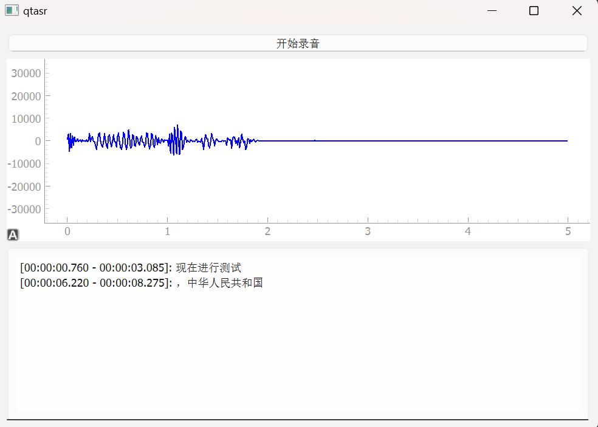

## qtasr(demo)

一个采集麦克风音频，并进行波形图显示与实时语音识别的demo。

客户端GUI界面使用Qt6(PySide6)开发。

实时语音识别服务使用FunASR。



### 安装与使用

```sh
# 安装依赖，仅需执行一次
pip install -r requirements.txt
# 启动FunASR实时语音识别服务，请参考附录
# 启动程序
python main.py
```

### 附录

* [FunASR实时语音识别安装文档](https://github.com/modelscope/FunASR/blob/main/runtime/docs/SDK_advanced_guide_online_zh.md)